# Proyecto Clinica Online.

Página web diseñada para la gestión online de turnos de manera sencilla y rápida. Dentro de la web te encontrarás con un inicio de sesión y registro. Pudiendo así desempeñar, dependiendo el usuario, diferentes funcionalidades.

## Bienvenida
Aquí se encontrará con una bienvenida y con 2 botones, para registrarse o loguearse.
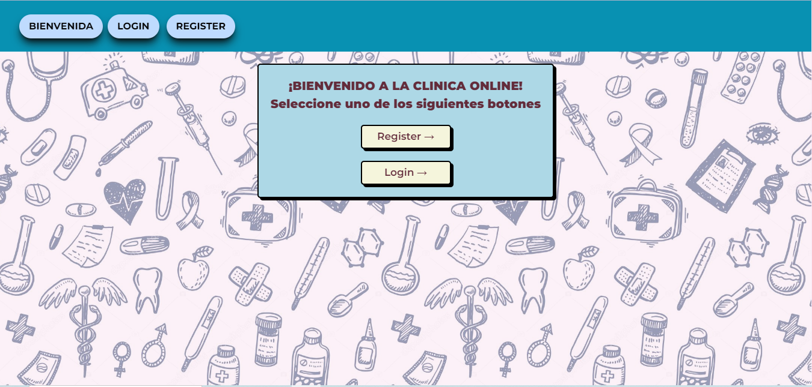

## Registrar
Dentro de esta sección encontraras una selección de usuario para registrar, ya sea paciente o especialista. Luego, deberá llenar un formulario.

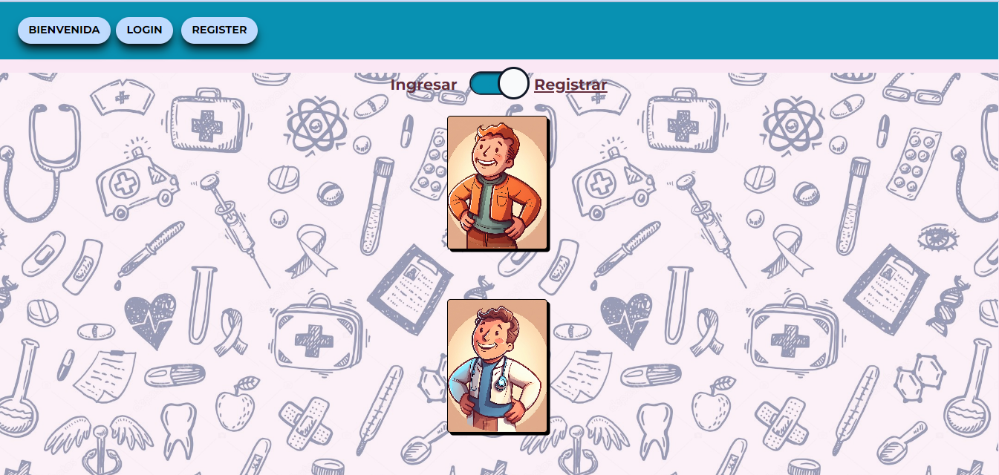

### formulario.

Una vez seleccionado uno debera llenar el formulario con todos los datos requeridos, deberá realizar el captcha.
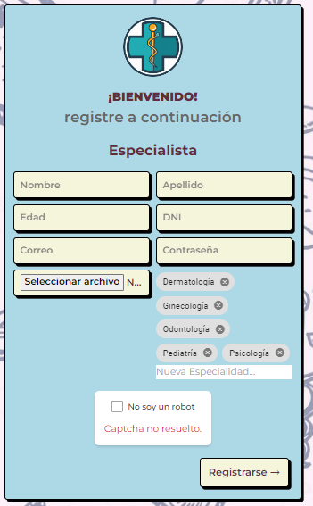

## Inicio de Sesión
Dentro del login tendrá un formulario con botones de completado rápido, 3 pacientes, 2 especialista y un administrador. O colocar su cuenta registrada y una vez verificado el email.
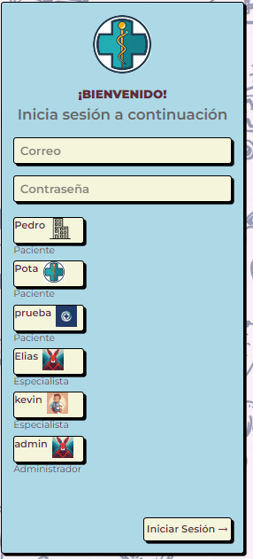

## Ingreso con Paciente
Siendo paciente encontrará una navegación con secciones que el mismo está permitido realizar y la sección perfil.

### Solicitar Turno
Dentro de solicitar turno deberá seleccionar unos de los especialistas, luego especialidad,luego la fecha y por último el horario.
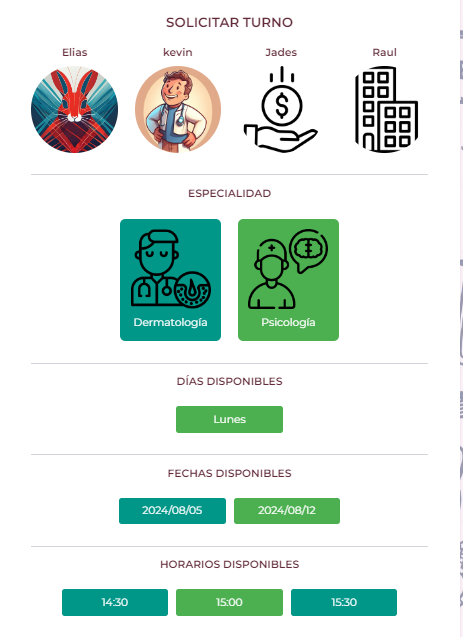

### Mis turnos
Dentro podrá ver los turnos que tengas como paciente, con la descripción de todos los turnos, ya sean realizados o no.
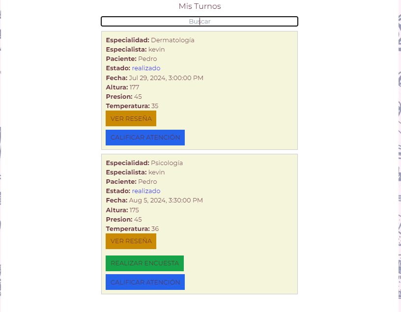

## Perfil
Dentro de la sección perfil encontrará la información del mismo. Dependiendo el tipo de usuario mostrará una cosa u otra.
### Paciente

### Especialista

## Ingreso con Paciente
Siendo especialista se econtrará con una navegación con sus funciones. Sección paciente donde encontrará aquellos pacientes quienes haya atendido al menos una vez.

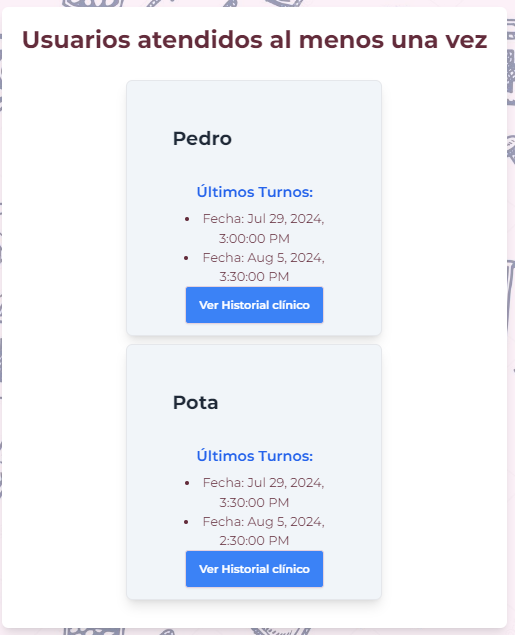

## Turnos interacciones
Cada vez que se interactue con los turnos, ya sea paciente, especialista, administrador se encontrará con ventanas modales, ya sea desde un componente o un swal, siendo que no necesitaban mucha lógica para generar un componente para cada uno. 

### Cancelar Turno
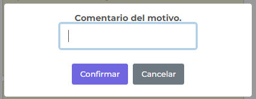

### Finalizar Turno
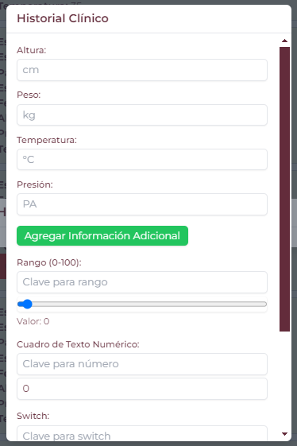

### Realizar encuesta
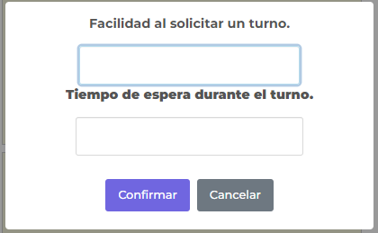

### Calificar atención
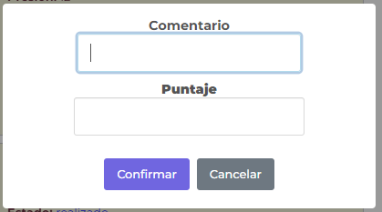

### Ver reseña
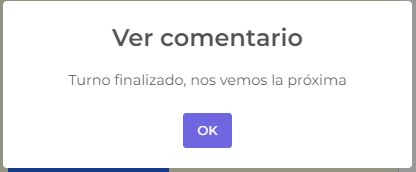
